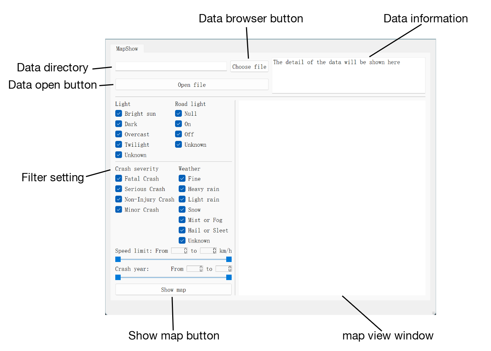
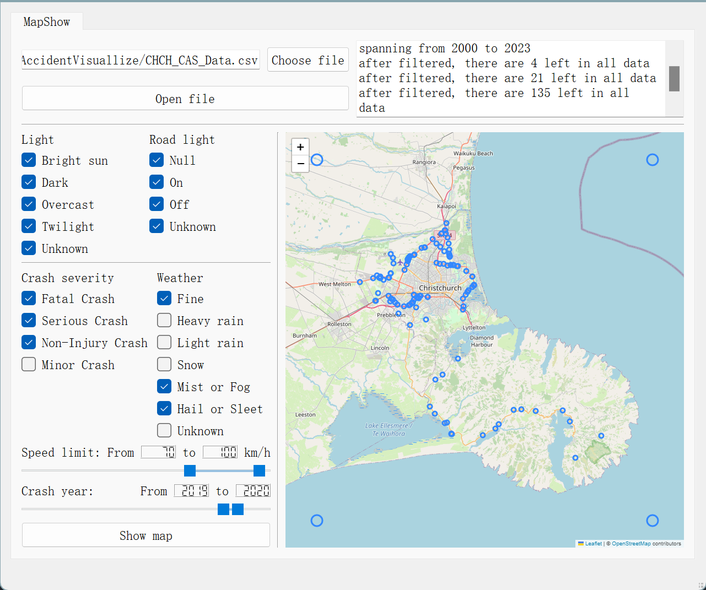

# Christchurch Traffic Accident Visualization

## Introduction

### background

In modern cities, the frequency and severity of traffic accidents are significant public safety issues. To better understand and prevent these accidents, we need to delve into traffic accident data. However, these data often contain a large number of variables and complex patterns, making it a challenge to understand and interpret them. Therefore, I developed this project, which can visualize traffic accident data points in Christchurch based on different setting conditions. Through this project, I hope to provide a powerful and flexible tool to help traffic planners, policymakers, researchers, and the public better understand the traffic safety situation in Christchurch, thereby formulating more effective strategies and measures to prevent traffic accidents.

### Dataset

The data for this project comes from the Crash Analysis System (CAS) provided by the New Zealand Transport Agency (NZTA). CAS records all traffic crashes reported to them by the New Zealand Police. It covers crashes on all New Zealand roadways or places where the public have legal access with a motor vehicle. The data is available from January 1, 2000, and includes crash variables that are non-personal data. This comprehensive dataset allows for a detailed analysis of traffic accidents in Christchurch, contributing to the development of effective strategies and measures for accident prevention. In order to focus on the traffic accident data in Christchurch, this project filters according to the attribute columns of the data, retaining only the traffic accident data that occurred in Christchurch. 

## Project Information

### Projection Description

The primary objective of this project is to create a flexible visualization tool that displays traffic accident data in Christchurch based on various user-specified settings. These settings may include the year of the accident, current daylight conditions, weather conditions, casualty severity, and artificial illumination conditions. By adjusting these settings, all data points that meet the criteria can be visualized on the map. Users can observe and understand the data from different perspectives and levels, uncovering patterns and trends hidden within the data.

### Project Structure

In the project directory, you will find the following files:

- `app_main.py`: The main entry point of the project. Running this Python file will start the entire project.
- `data_processing.py`: This file contains all functions related to preliminary data processing.
- `user_interface.py`: This file contains the layout of the PyQt window and implements the entire visualization interface.
- `ui_function.py`: This file contains all function implementations related to the interactive interface, including browsing files, opening files, creating filters, loading maps, etc.
- `folium_map_generator.py`: This file contains functions related to generating maps using Folium.
- `map.html`: This file is generated by Folium library. contain all the map information ,will be uploaded by PyQT5.
- `CHCH_CAS_Data.csv`: This is the dataset of CAS in Christchurch.
- `requirement.txt`: This file contain every requirement library for this project.

### Requirement

This project is built using Python and developed in the PyCharm IDE, using Python version 3.10. It has been tested to run on both macOS and Windows. The project utilizes third-party Python libraries including but not limited to `Folium`, `PyQt5`, and `Pandas`. All dependencies are listed in the `requirements.txt` file located in the project directory. You can install all required dependencies by running the following command:

```bash
pip install -r requirement.txt
```


## Project Demo

### Interface Information



### Operation Demo

1. Click the **Choose file** button to open the file browser. In the file browser, locate the `CHCH_CAS_Data.csv` file in the project directory and click **Open**. The file path will automatically load into the **Data directory** text box. Then click the **Open file** button to load the data. Once the data is loaded, the data information will be displayed in the **Data information** text box.
2. Adjust the checkboxes in the **Filter setting** section as needed; by default, all data is selected.
3. Click the **Show map** button. The program will automatically load the filtered data points onto the map based on the settings in the **Filter setting** section and display them in the **map view window**. The visualization result can be manipulated by dragging with the left mouse button and zooming with the mouse wheel.

The program output is as follows:



* If the opened file is not a data file, the program will automatically display a notification saying "Please choose a valid file."
* If no data file is opened and the Show Map button is clicked, a notification saying "You didn't open any data." will be displayed.

## Development Process
### Learning PyQt5
The first step in building this project was designing a feasible user interface to provide space for subsequent operations. The overall UI design was visualized using PyQt5's built-in QtDesigner. This step encountered several challenges:
1. PyQt5 provides slider controls that only offer precise values and cannot set relative ranges. Considerable time was spent searching for solutions to adapt the speed limit and time range for this project. Eventually, a third-party implementation of a range slider was found and integrated into the project.
2. Due to the extensive data provided by the Ministry of Transport, it was impossible to display all information in the interactive interface. Therefore, the project decided to use four significant pieces of information as visualization filters.
3. Significant time was spent correctly matching the relative positions of different controls and implementing window size adaptability.
### Learning Folium
1. Information about the Folium library was obtained from GPT, followed by an in-depth study of Folium's official documentation. Folium's extensive sample code was crucial for this project's development.
2. The project uses Folium's geofencing feature to limit the visualization area to the Christchurch region, preventing user misoperations from causing difficulty in returning to the original position.
3. Circles are used to represent data points. The filtered data is visualized on the map as coordinate points.
Since Folium does not support real-time refresh, the user's filter information cannot be updated in real-time; the map must be manually regenerated.
### Learning Git and GitHub
* The project uses Git for version control and is synchronized with GitHub. While developing the project, I learned how to use Git effectively.
## Future work
1. Add a data analysis module to analyze patterns in the existing data.
2. Integrate AI models to predict the likelihood of accidents on specific routes, helping people avoid accidents.
3. Connect to the Google Maps API to provide real-time notifications of historical accident hotspots based on navigation.